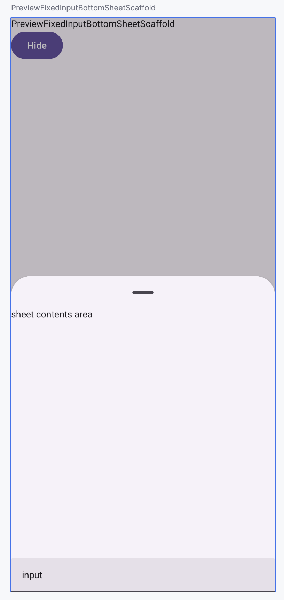

# Instagram을 참고하여 만든 CommentBottomSheet

## CommentBottomSheet를 만들게 된 이유

ModalBottomSheet로 간단히 구현하려 했는데,모달 상태에서 하단에 입력창을 고정하는 방법이 마땅치 않음.<br>
BottomSheetScaffold는 시트 위에 위젯 배치가 가능해서,더 유연하게 커스텀할 수 있어 이걸로 결정함.

## 특징

- 스크롤과 관계없이 하단에 고정된 TextField 표시
- BottomSheet가 사라질 때 TextField도 함께 내려감
- BottomSheetScaffold에 배경 dim 효과 적용
- 스크롤 위치에 따라 dim 강도 동적 조절

## 스크롤과 관계없이 하단에 고정된 TextField 표시

고정된 input() 영역 구현은 간단.<br>
Box로 감싼 후 input영역을 box하단에 배치

FixedInputBottomSheetScaffold.kt



```
Box(modifier = modifier.imePadding()) { // edge to edge 에서 imePadding을 줘야 하단 영역이 적용됨
    TorangBottomSheetScaffold(
		...
    )
    if (show) // sheet가 보이면 input 영역 보이기
        Box(
            modifier = Modifier
                .align(Alignment.BottomCenter)
                .absoluteOffset(y = inputOffset),
        ) {
            input()
        }
}
```